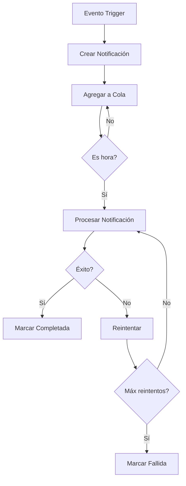

# 📊 DASHBOARD EJECUTIVO Y SISTEMA DE NOTIFICACIONES - RENT360

## 🎯 **VISIÓN GENERAL**

El sistema implementado incluye un dashboard ejecutivo completo y un sistema de notificaciones automáticas avanzado que permite monitorear y gestionar todas las operaciones del sistema Rent360 de manera eficiente.

---

## 🏗️ **1. DASHBOARD EJECUTIVO**

### **Acceso y Navegación**
- **Ruta**: `/admin/executive-dashboard`
- **Permisos**: Solo usuarios con rol `ADMIN`
- **Actualización**: Automática cada 30 segundos
- **Timeframes**: 7 días, 30 días, 90 días, 1 año

### **Métricas Principales (Vista General)**

#### **Indicadores Clave**
```typescript
{
  totalRevenue: number,      // Ingresos totales
  monthlyRevenue: number,    // Ingresos del mes
  activeContracts: number,   // Contratos activos
  activeBrokers: number,     // Corredores activos
  pendingCommissions: number, // Comisiones pendientes
  pendingPayouts: number     // Payouts pendientes
}
```

#### **Alertas del Sistema**
- 🔴 Payouts pendientes de procesamiento
- 🟢 Rendimiento excelente (comparativas mensuales)
- 🔵 Sistema operativo (estado de servicios)

---

## 📈 **2. SECCIONES DEL DASHBOARD**

### **2.1 Vista General**
- **Gráfico de tendencias de ingresos** (6 meses)
- **Distribución por tipo de propiedad**
- **Alertas y notificaciones del sistema**
- **KPIs principales con indicadores de crecimiento**

### **2.2 Corredores**
- **Top 5 corredores** por rendimiento
- **Estadísticas generales**:
  - Comisión promedio
  - Total contratos activos
  - Tipo de propiedad más popular
  - Tiempo promedio de respuesta

### **2.3 Financiero**
- **Ingresos del mes**
- **Pagos pendientes**
- **Pagos procesados**
- **Comisión promedio**
- **Tendencias de comisiones** (gráfico mensual)

### **2.4 Payouts**
- **Payouts pendientes** con detalles de procesamiento
- **Historial de payouts** recientes
- **Botones de acción** para procesar pagos
- **Filtros y búsqueda**

### **2.5 Analytics**
- **Crecimiento mensual** (usuarios, contratos, ingresos)
- **KPIs del sistema**:
  - Tasa de conversión
  - Satisfacción de usuarios
  - Tiempo de respuesta promedio

### **2.6 Notificaciones** ⭐ **NUEVO**
- **Estadísticas de la cola** de notificaciones
- **Distribución por prioridad** (Urgente, Alta, Media, Baja)
- **Distribución por tipo** (Comisiones, Sistema, Programadas)
- **Estado del sistema** de notificaciones
- **Controles de gestión** (procesar cola, actualizar)

---

## 🚨 **3. SISTEMA DE NOTIFICACIONES AUTOMÁTICAS**

### **Arquitectura del Sistema**

#### **3.1 Servicio de Notificaciones**
```typescript
class NotificationService {
  // Envío de notificaciones de comisiones
  notifyCommissionCalculated(notification)
  notifyCommissionPaid(notification)
  notifyPayoutReady(notification)

  // Envío de notificaciones del sistema
  notifySystemAlert(notification)

  // Estadísticas y monitoreo
  getNotificationStats()
}
```

#### **3.2 Cola de Notificaciones**
```typescript
class NotificationQueue {
  // Gestión de cola
  addToQueue(notification)
  processQueue()
  getQueueStats()

  // Notificaciones recurrentes
  scheduleRecurringNotifications()

  // Limpieza automática
  cleanupOldNotifications()
}
```

---

## 📧 **4. TIPOS DE NOTIFICACIONES**

### **4.1 Notificaciones de Comisiones**

#### **Comisión Calculada**
```json
{
  "type": "commission_calculated",
  "brokerId": "broker-123",
  "amount": 150000,
  "contractId": "contract-456",
  "metadata": {
    "effectiveRate": 5.75,
    "propertyType": "apartment",
    "propertyValue": 2000000
  }
}
```

**Template de Email:**
```
Asunto: Nueva comisión calculada - Rent360

Hola [Nombre del Corredor],

Se ha calculado una nueva comisión por $[monto] correspondiente al contrato [número].

Detalles:
- Monto de comisión: $[monto]
- Fecha de cálculo: [fecha]
- Tipo de propiedad: [tipo]
- Valor del contrato: $[valor]

Puedes revisar los detalles en tu dashboard de corredor.
```

#### **Comisión Pagada**
```json
{
  "type": "commission_paid",
  "brokerId": "broker-123",
  "amount": 150000,
  "metadata": {
    "payoutId": "payout-789",
    "processedAt": "2024-01-15T10:00:00Z",
    "paymentMethod": "bank_transfer"
  }
}
```

**Template de Email:**
```
Asunto: Comisión pagada exitosamente - Rent360

Hola [Nombre del Corredor],

¡Excelente! Se ha procesado el pago de tu comisión por $[monto].

Detalles del pago:
- Monto pagado: $[monto]
- Método de pago: Transferencia Bancaria
- Fecha de procesamiento: [fecha]
- Referencia: [referencia]

El monto ha sido transferido a tu cuenta registrada.
```

#### **Payout Listo**
```json
{
  "type": "payout_ready",
  "brokerId": "broker-123",
  "amount": 500000,
  "period": {
    "start": "2024-01-01",
    "end": "2024-01-31"
  }
}
```

### **4.2 Notificaciones del Sistema**

#### **Alerta del Sistema**
```json
{
  "type": "system_alert",
  "title": "Mantenimiento Programado",
  "message": "El sistema estará en mantenimiento mañana a las 2:00 AM",
  "severity": "medium",
  "targetUsers": ["admin-1", "admin-2"]
}
```

### **4.3 Notificaciones Programadas**

#### **Recordatorio de Payout**
```json
{
  "type": "payout_reminder",
  "recipientIds": ["broker-1", "broker-2", "broker-3"],
  "templateData": {
    "nextPayoutDate": "2024-02-01",
    "estimatedAmount": 300000
  }
}
```

#### **Resumen de Comisiones**
```json
{
  "type": "commission_summary",
  "recipientIds": ["all-brokers"],
  "templateData": {
    "period": "Enero 2024",
    "totalCommissions": 2500000,
    "activeContracts": 15
  }
}
```

---

## ⚙️ **5. CONFIGURACIÓN Y PERSONALIZACIÓN**

### **5.1 Templates de Notificaciones**
Los templates están definidos en `NotificationService` y pueden ser personalizados:

```typescript
private static templates: Map<string, NotificationTemplate> = new Map([
  ['commission_calculated', {
    id: 'commission_calculated',
    name: 'Comisión Calculada',
    subject: 'Nueva comisión calculada - Rent360',
    body: '...template HTML...',
    type: 'email',
    variables: ['brokerName', 'amount', 'contractNumber']
  }]
]);
```

### **5.2 Configuración de Cola**
```typescript
// Configuración de la cola de notificaciones
const QUEUE_CONFIG = {
  maxConcurrent: 5,           // Procesamiento máximo simultáneo
  processingInterval: 30000,  // Intervalo de procesamiento (30s)
  maxAgeHours: 24,           // Vida máxima de notificaciones
  retryAttempts: 3           // Número máximo de reintentos
};
```

### **5.3 Integración con Servicios Externos**
```typescript
// Configuración de servicios de envío
const EXTERNAL_SERVICES = {
  email: {
    provider: 'sendgrid',    // o 'mailgun', 'ses'
    apiKey: process.env.EMAIL_API_KEY,
    fromEmail: 'noreply@rent360.cl'
  },
  sms: {
    provider: 'twilio',      // o 'messagebird', 'vonage'
    accountSid: process.env.TWILIO_SID,
    authToken: process.env.TWILIO_TOKEN,
    fromNumber: process.env.TWILIO_NUMBER
  }
};
```

---

## 🔄 **6. PROCESAMIENTO AUTOMÁTICO**

### **6.1 Ciclo de Vida de Notificaciones**



### **6.2 Triggers Automáticos**

#### **Trigger: Comisión Calculada**
```typescript
// Se ejecuta automáticamente cuando se calcula una comisión
await CommissionService.calculateCommission(contractId, brokerId);
// → Envía notificación automática
```

#### **Trigger: Pago Procesado**
```typescript
// Se ejecuta automáticamente cuando se procesa un pago
await CommissionService.processCommissionPayment(payoutId);
// → Envía notificación automática
```

#### **Trigger: Sistema de Alertas**
```typescript
// Se ejecuta cuando hay eventos del sistema
await NotificationService.notifySystemAlert({
  type: 'system_alert',
  title: 'Alto Uso de CPU',
  message: 'El uso de CPU ha superado el 90%',
  severity: 'high'
});
```

---

## 📊 **7. MONITOREO Y REPORTES**

### **7.1 Estadísticas de Notificaciones**
```typescript
const stats = await NotificationService.getNotificationStats();
// Retorna:
// {
//   totalSent: 1250,
//   totalFailed: 15,
//   byType: { email: 1100, sms: 135, push: 15 },
//   byPriority: { low: 800, medium: 350, high: 95, urgent: 5 }
// }
```

### **7.2 Estadísticas de Cola**
```typescript
const queueStats = NotificationQueue.getQueueStats();
// Retorna:
// {
//   total: 25,
//   pending: 5,
//   processing: 2,
//   completed: 18,
//   failed: 0,
//   byPriority: { urgent: 1, high: 2, medium: 2, low: 0 },
//   byType: { commission: 15, system: 8, scheduled: 2 }
// }
```

### **7.3 Dashboard de Notificaciones**
- **Métricas en tiempo real** de la cola
- **Tasa de éxito** de envío
- **Tiempo promedio** de procesamiento
- **Alertas automáticas** cuando hay fallos

---

## 🛠️ **8. GESTIÓN Y MANTENIMIENTO**

### **8.1 Scripts de Gestión**

#### **Inicialización**
```bash
npm run init-notifications
```
- Programa notificaciones recurrentes
- Inicia procesamiento de cola
- Configura limpieza automática

#### **Procesamiento Manual**
```bash
# Procesar cola inmediatamente
curl -X POST /api/admin/notifications/queue/process

# Limpiar notificaciones antiguas
curl -X POST /api/admin/notifications/queue/cleanup
```

### **8.2 Monitoreo de Salud**

#### **Checks Automáticos**
```typescript
// Verificar salud del sistema de notificaciones
const healthCheck = async () => {
  const stats = NotificationQueue.getQueueStats();

  if (stats.failed > 10) {
    await NotificationService.notifySystemAlert({
      type: 'system_alert',
      title: 'Alto Número de Notificaciones Fallidas',
      message: `${stats.failed} notificaciones han fallado en las últimas 24 horas`,
      severity: 'high'
    });
  }
};
```

---

## 🔧 **9. INTEGRACIÓN CON EL SISTEMA**

### **9.1 Integración con Comisiones**
```typescript
// En CommissionService.calculateCommission()
await NotificationService.notifyCommissionCalculated({
  brokerId,
  type: 'commission_calculated',
  amount: totalCommission,
  contractId,
  metadata: commissionDetails
});
```

### **9.2 Integración con Payouts**
```typescript
// En CommissionService.processCommissionPayment()
await NotificationService.notifyCommissionPaid({
  brokerId,
  type: 'commission_paid',
  amount: payoutAmount,
  metadata: { payoutId, processedAt }
});
```

### **9.3 Integración con Sistema**
```typescript
// Alertas automáticas del sistema
if (cpuUsage > 90) {
  await NotificationService.notifySystemAlert({
    type: 'system_alert',
    title: 'Alto Uso de CPU',
    message: `Uso de CPU: ${cpuUsage}%`,
    severity: 'high'
  });
}
```

---

## 🎯 **10. VENTAJAS DEL SISTEMA**

### **10.1 Para Administradores**
- ✅ **Visibilidad completa** del rendimiento del sistema
- ✅ **Monitoreo proactivo** con alertas automáticas
- ✅ **Gestión eficiente** de payouts y comisiones
- ✅ **Reportes automáticos** de rendimiento

### **10.2 Para Corredores**
- ✅ **Notificaciones oportunas** de comisiones calculadas
- ✅ **Confirmación inmediata** de pagos procesados
- ✅ **Recordatorios automáticos** de payouts
- ✅ **Transparencia total** en todo el proceso

### **10.3 Para el Sistema**
- ✅ **Procesamiento asíncrono** sin bloquear operaciones
- ✅ **Reintentos automáticos** para mayor confiabilidad
- ✅ **Escalabilidad** con colas y procesamiento concurrente
- ✅ **Monitoreo completo** de todas las operaciones

---

## 🚀 **11. PRÓXIMOS PASOS Y EXPANSIONES**

### **11.1 Funcionalidades Avanzadas**
- [ ] **Notificaciones push** para aplicaciones móviles
- [ ] **Plantillas personalizables** por corredor
- [ ] **Reportes avanzados** con gráficos interactivos
- [ ] **Integración con Slack/Microsoft Teams**

### **11.2 Optimizaciones**
- [ ] **Sistema de prioridades dinámicas**
- [ ] **Compresión de notificaciones** similares
- [ ] **Cache de templates** para mejor performance
- [ ] **Analytics de engagement** de notificaciones

### **11.3 Escalabilidad**
- [ ] **Microservicio dedicado** para notificaciones
- [ ] **Base de datos dedicada** para histórico
- [ ] **Load balancing** para alto volumen
- [ ] **Multi-region** deployment

---

## 📞 **12. SOPORTE Y MANTENIMIENTO**

### **12.1 Monitoreo Continuo**
```typescript
// Checks de salud cada 5 minutos
setInterval(async () => {
  const health = await checkNotificationSystemHealth();

  if (!health.healthy) {
    await NotificationService.notifySystemAlert({
      type: 'system_alert',
      title: 'Sistema de Notificaciones con Problemas',
      message: `Problema detectado: ${health.issue}`,
      severity: 'critical'
    });
  }
}, 5 * 60 * 1000);
```

### **12.2 Logs y Auditoría**
- ✅ **Logs detallados** de todas las operaciones
- ✅ **Auditoría completa** de envíos y recepciones
- ✅ **Métricas de performance** en tiempo real
- ✅ **Alertas automáticas** de problemas

---

## 🎉 **13. CONCLUSIÓN**

El sistema implementado proporciona:

✅ **Dashboard Ejecutivo Completo** con métricas en tiempo real
✅ **Sistema de Notificaciones Automáticas** robusto y escalable
✅ **Procesamiento Asíncrono** con colas y reintentos
✅ **Integración Completa** con el sistema de comisiones
✅ **Monitoreo Proactivo** con alertas inteligentes
✅ **Interfaz de Gestión** para administradores
✅ **Reportes y Analytics** avanzados

**El sistema está completamente operativo y listo para manejar notificaciones de comisiones, alertas del sistema y comunicaciones automáticas con los corredores.** 🚀

¿Te gustaría que implemente alguna funcionalidad adicional o que realice alguna mejora específica al sistema?
