# 📊 FLUJO COMPLETO DE MONETIZACIÓN DE CORREDORES - RENT360

## 🎯 **VISIÓN GENERAL**

El sistema de monetización de corredores en Rent360 está diseñado para ser transparente, automatizado y escalable. Los corredores ganan comisiones basadas en contratos exitosos, con un sistema flexible de porcentajes configurables por administradores.

---

## ⚙️ **1. CONFIGURACIÓN DEL SISTEMA (ADMIN)**

### **Acceso a Configuraciones**
- **Ruta**: `/admin/settings/enhanced`
- **Permisos**: Solo usuarios con rol `ADMIN`

### **Parámetros Configurables**

```typescript
interface CommissionConfig {
  // Porcentaje base por defecto
  defaultCommissionRate: number; // Ej: 5.0 (%)

  // Estructura de cálculo
  commissionStructure: 'fixed' | 'percentage' | 'tiered';

  // Monto mínimo garantizado
  minimumCommissionAmount: number; // Ej: 50000 (CLP)

  // Método de pago
  commissionPaymentMethod: string; // 'bank_transfer', 'paypal', etc.

  // Frecuencia de pagos
  commissionSchedule: 'immediate' | 'weekly' | 'monthly';
}
```

### **Ejemplo de Configuración**
```json
{
  "defaultCommissionRate": 5.0,
  "commissionStructure": "percentage",
  "minimumCommissionAmount": 50000,
  "commissionPaymentMethod": "bank_transfer",
  "commissionSchedule": "monthly"
}
```

---

## 🏠 **2. ESTRUCTURA DE COMISIONES POR TIPO DE PROPIEDAD**

### **Tabla de Porcentajes Base**

| Tipo de Propiedad | Valor < 10M | Valor 10M-30M | Valor > 30M |
|-------------------|-------------|----------------|-------------|
| **Departamento** | 5.0% | 4.0% | 3.0% |
| **Casa** | 4.5% | 3.5% | 2.5% |
| **Oficina** | 4.0% | 3.0% | 2.0% |
| **Local Comercial** | 3.5% | 2.5% | 2.0% |

### **Cálculo Base**
```typescript
const baseCommission = (propertyValue * percentage) / 100;
```

---

## 🎁 **3. SISTEMA DE BONOS ADICIONALES**

### **Bonos Disponibles**

#### **3.1 Bono por Contrato Exclusivo**
- **Porcentaje**: +10% sobre comisión base
- **Condición**: Contrato marcado como `isExclusive: true`
- **Ejemplo**: Comisión base $100.000 → Bono $10.000

#### **3.2 Bono por Servicios Adicionales**
- **Porcentaje**: +5% sobre comisión base
- **Condición**: `hasAdditionalServices: true`
- **Ejemplo**: Gestión de mudanza, limpieza, etc.

#### **3.3 Bono por Cliente Premium**
- **Porcentaje**: +15% sobre comisión base
- **Condición**: Cliente tipo `premium`
- **Características**: Empresas medianas, contratos recurrentes

#### **3.4 Bono por Cliente Corporativo**
- **Porcentaje**: +20% sobre comisión base
- **Condición**: Cliente tipo `corporate`
- **Características**: Grandes empresas, contratos masivos

#### **3.5 Bono por Propiedad de Alto Valor**
- **Porcentaje**: +5% sobre comisión base
- **Condición**: Valor de propiedad > $100.000.000
- **Propósito**: Incentivar gestión de propiedades premium

### **Cálculo con Bonos**
```typescript
const totalCommission = baseCommission + totalBonuses - totalDeductions;

// Garantía de monto mínimo
const finalCommission = Math.max(totalCommission, minimumCommissionAmount);
```

---

## 💸 **4. SISTEMA DE DEDUCCIONES**

### **Deducciones Aplicables**

#### **4.1 Deducción por Retraso en Pagos**
- **Porcentaje**: -10% sobre comisión base
- **Condición**: `hasPaymentDelays: true`
- **Propósito**: Incentivar cobranza efectiva

### **Ejemplo de Deducción**
```typescript
if (contract.hasPaymentDelays) {
  deductions.push({
    type: 'payment_delay',
    amount: baseCommission * 0.1,
    reason: 'Deducción por retraso en pagos (10%)'
  });
}
```

---

## 📋 **5. FLUJO OPERATIVO COMPLETO**

### **FASE 1: Configuración Inicial**


### **FASE 2: Asignación de Corredor**

```mermaid
graph TD
    A[Propiedad Publicada] --> B[Owner Selecciona Corredor]
    B --> C[Contrato Creado con brokerId]
    C --> D[Corredor Asignado Automáticamente]
    D --> E[Comisión Calculada en Background]
```


### **FASE 3: Cálculo de Comisión**

```mermaid
graph TD
    A[Contrato Firmado] --> B[Obtener Valor de Propiedad]
    B --> C[Determinar Tipo de Propiedad]
    C --> D[Calcular Comisión Base]
    D --> E[Evaluar Bonos Adicionales]
    E --> F[Calcular Deducciones]
    F --> G[Comisión Final Calculada]
```


### **FASE 4: Generación de Payout**

```mermaid
graph TD
    A[Inicio de Período] --> B[Recopilar Contratos Activos]
    B --> C[Calcular Comisiones por Contrato]
    C --> D[Generar Reporte Consolidado]
    D --> E[Crear Registro de Payout]
    E --> F[Payout Listo para Procesamiento]
```


### **FASE 5: Procesamiento de Pago**

```mermaid
graph TD
    A[Payout Generado] --> B[Validar Información Bancaria]
    B --> C[Procesar Transferencia]
    C --> D[Actualizar Estado a 'paid']
    D --> E[Enviar Notificación al Corredor]
    E --> F[Registrar en Historial]
```


---

## 🔧 **6. APIs DISPONIBLES**

### **6.1 Para Corredores**

#### **GET /api/broker/commissions**
Obtiene estadísticas de comisiones del corredor.

**Respuesta:**
```json
{
  "success": true,
  "data": {
    "totalContracts": 15,
    "totalCommissionValue": 2500000,
    "averageCommission": 166667,
    "monthlyRevenue": 2500000,
    "contractsByType": {
      "apartment": 10,
      "house": 5
    },
    "commissionConfig": {
      "defaultCommissionRate": 5.0,
      "commissionStructure": "percentage",
      "minimumCommissionAmount": 50000,
      "commissionPaymentMethod": "bank_transfer",
      "commissionSchedule": "monthly"
    }
  }
}
```

#### **POST /api/broker/commissions/calculate**
Calcula comisión para un contrato específico.

**Request:**
```json
{
  "contractId": "contract-123"
}
```

**Respuesta:**
```json
{
  "success": true,
  "data": {
    "contractId": "contract-123",
    "brokerId": "broker-456",
    "propertyValue": 2000000,
    "propertyType": "apartment",
    "baseCommission": 100000,
    "bonusCommission": 15000,
    "totalCommission": 115000,
    "effectiveRate": 5.75,
    "breakdown": {
      "baseAmount": 100000,
      "bonuses": [
        {
          "type": "premium_client",
          "amount": 15000,
          "reason": "Bono por cliente premium (15%)"
        }
      ],
      "deductions": []
    }
  }
}
```

### **6.2 Para Administradores**

#### **GET /api/admin/commissions/config**
Obtiene configuración actual de comisiones.

#### **POST /api/admin/commissions/calculate**
Calcula comisión para cualquier contrato (modo admin).

#### **POST /api/admin/commissions/payouts**
Genera payout de comisiones para un broker.

**Request:**
```json
{
  "brokerId": "broker-456",
  "startDate": "2024-01-01",
  "endDate": "2024-01-31"
}
```

---

## 📊 **7. DASHBOARD DEL CORREDOR**

### **7.1 Métricas Principales**
- **Total de Contratos Activos**: 15
- **Valor Total de Comisiones**: $2.500.000
- **Comisión Promedio**: $166.667
- **Ingresos Mensuales**: $2.500.000
- **Contratos por Tipo**: Gráficos interactivos

### **7.2 Desglose por Tipo de Propiedad**
```json
{
  "apartments": {
    "count": 10,
    "totalValue": 15000000,
    "totalCommission": 675000
  },
  "houses": {
    "count": 5,
    "totalValue": 20000000,
    "totalCommission": 800000
  }
}
```

### **7.3 Historial de Pagos**
- Registro completo de payouts procesados
- Estado de pagos pendientes
- Próxima fecha de pago estimada

---

## 💰 **8. EJEMPLOS PRÁCTICOS DE CÁLCULO**

### **Ejemplo 1: Departamento Estándar**
```typescript
const propertyValue = 2000000; // $2.000.000 CLP
const baseRate = 5.0; // 5%
const baseCommission = (2000000 * 5.0) / 100; // $100.000

// Con bono por cliente premium (+15%)
const premiumBonus = 100000 * 0.15; // $15.000
const totalCommission = 100000 + 15000; // $115.000
const effectiveRate = (115000 / 2000000) * 100; // 5.75%
```

### **Ejemplo 2: Casa Premium con Servicios Adicionales**
```typescript
const propertyValue = 50000000; // $50.000.000 CLP
const baseRate = 3.5; // 3.5% para casas > $20M
const baseCommission = (50000000 * 3.5) / 100; // $1.750.000

// Bonos aplicables:
const exclusiveBonus = 1750000 * 0.1; // $175.000 (contrato exclusivo)
const serviceBonus = 1750000 * 0.05; // $87.500 (servicios adicionales)
const highValueBonus = 1750000 * 0.05; // $87.500 (propiedad > $100M)

const totalBonuses = 175000 + 87500 + 87500; // $350.000
const totalCommission = 1750000 + 350000; // $2.100.000
```

### **Ejemplo 3: Caso con Deducciones**
```typescript
const propertyValue = 1500000; // $1.500.000 CLP
const baseRate = 5.0; // 5%
const baseCommission = (1500000 * 5.0) / 100; // $75.000

// Bono por cliente corporativo (+20%)
const corporateBonus = 75000 * 0.2; // $15.000

// Deducción por retraso en pagos (-10%)
const paymentDelayDeduction = 75000 * 0.1; // $7.500

const subtotal = 75000 + 15000 - 7500; // $82.500
const totalCommission = Math.max(82500, 50000); // $82.500 (sobre mínimo)
```

---

## 🔄 **9. CICLO DE PAGOS AUTOMATIZADO**

### **9.1 Programación de Pagos**
- **Inmediato**: Pago al momento de firma del contrato
- **Semanal**: Todos los viernes a las 18:00
- **Mensual**: Primer día hábil de cada mes

### **9.2 Proceso Automatizado**
```typescript
async function processMonthlyPayouts() {
  // 1. Obtener todos los corredores activos
  const brokers = await db.user.findMany({
    where: { role: 'BROKER', isActive: true }
  });

  // 2. Para cada corredor, calcular comisiones del mes
  for (const broker of brokers) {
    const payout = await CommissionService.generateCommissionPayout(
      broker.id,
      startOfMonth,
      endOfMonth
    );

    // 3. Procesar pago automáticamente
    if (payout.amount > 0) {
      await CommissionService.processCommissionPayment(payout.id);

      // 4. Enviar notificación
      await notifyBroker(broker, payout);
    }
  }
}
```

### **9.3 Estados de Pago**
```typescript
enum PayoutStatus {
  PENDING = 'pending',     // Esperando procesamiento
  PROCESSING = 'processing', // En proceso de pago
  PAID = 'paid',           // Pagado exitosamente
  FAILED = 'failed'        // Error en el pago
}
```

---

## 📈 **10. REPORTES Y ANALYTICS**

### **10.1 Reportes Disponibles**
- **Comisiones por Corredor**: Historial completo
- **Tendencias Mensuales**: Gráficos de crecimiento
- **Comparativas**: Rendimiento entre corredores
- **Análisis por Tipo**: Comisiones por tipo de propiedad

### **10.2 KPIs de Seguimiento**
```typescript
interface BrokerKPIs {
  totalCommissions: number;
  averageCommission: number;
  successRate: number; // Contratos exitosos / Total asignados
  clientRetention: number; // Clientes recurrentes
  responseTime: number; // Tiempo promedio de respuesta
  satisfactionScore: number; // Calificación promedio
}
```

---

## 🚀 **11. ESCALABILIDAD Y OPTIMIZACIONES**

### **11.1 Cache Inteligente**
```typescript
// Cache de configuraciones (TTL: 1 hora)
const configCacheKey = CacheKeys.SYSTEM_METRICS + ':commission_config';

// Cache de cálculos de comisión (TTL: 24 horas)
const commissionCacheKey = `commission:${contractId}:${brokerId}`;
```

### **11.2 Optimizaciones de Base de Datos**
```sql
-- Índices para consultas eficientes
CREATE INDEX idx_contracts_broker_status ON contracts(broker_id, status);
CREATE INDEX idx_contracts_date_range ON contracts(start_date, end_date);
CREATE INDEX idx_users_role_active ON users(role, is_active);
```

### **11.3 Procesamiento Asíncrono**
- Cálculos de comisión en background
- Procesamiento de payouts programado
- Notificaciones automáticas
- Generación de reportes offline

---

## 🔐 **12. SEGURIDAD Y AUDITORÍA**

### **12.1 Controles de Seguridad**
- Validación de permisos por rol
- Auditoría completa de cambios
- Encriptación de datos sensibles
- Rate limiting en APIs

### **12.2 Registro de Auditoría**
```typescript
interface CommissionAuditLog {
  id: string;
  brokerId: string;
  contractId: string;
  action: 'calculated' | 'paid' | 'adjusted';
  oldValue?: number;
  newValue?: number;
  reason?: string;
  performedBy: string;
  timestamp: Date;
}
```

---

## 🎯 **13. CONCLUSIÓN**

El sistema de monetización de corredores de Rent360 ofrece:

✅ **Transparencia Total**: Cálculos claros y auditables
✅ **Flexibilidad**: Configuraciones adaptables por admin
✅ **Automatización**: Procesos completamente automatizados
✅ **Escalabilidad**: Diseño preparado para crecimiento
✅ **Rentabilidad**: Bonos que incentivan performance
✅ **Control**: Deducciones por incumplimientos

**El flujo completo garantiza que los corredores sean compensados justamente por su trabajo, mientras mantiene el control administrativo necesario para la sostenibilidad del negocio.**
